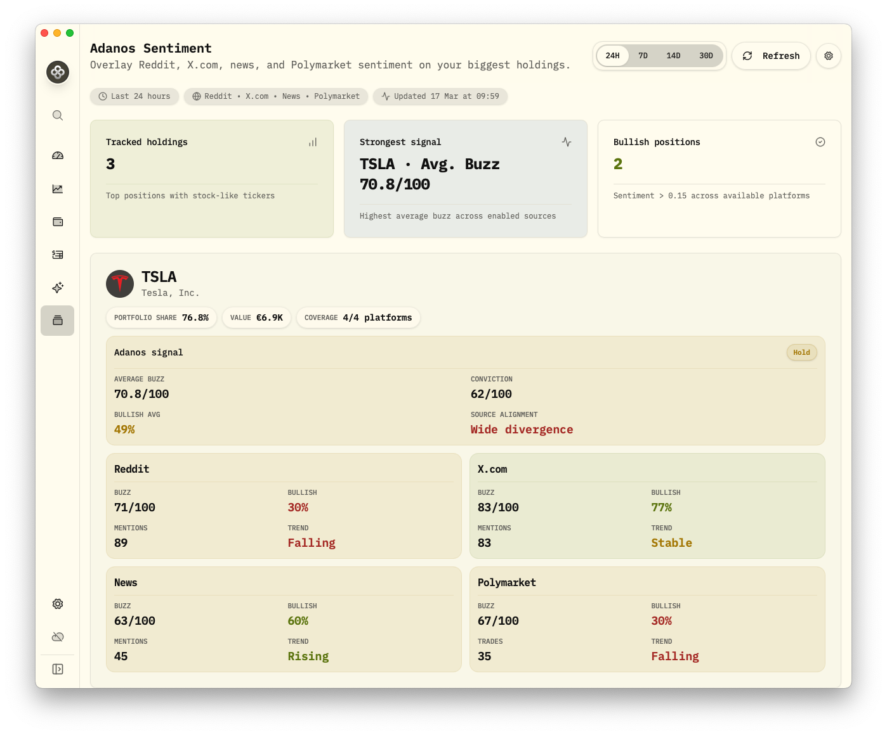

# Adanos Finance Sentiment API Addon for Wealthfolio



`adanos-sentiment` is a Wealthfolio add-on that overlays Adanos market
sentiment directly on top of portfolio holdings.

It combines finance sentiment from:

- Reddit
- X.com
- News
- Polymarket

The add-on is built for traders and active investors who want faster context on:

- where attention is building
- whether bullish conviction is broad or isolated
- whether momentum is rising, stable, or fading across sources
- which portfolio names are attracting the strongest composite signal

## What it shows

For each tracked holding, the add-on shows:

- composite Adanos signal
- average buzz
- conviction
- bullish average
- source alignment

For each enabled source, it shows:

- buzz
- bullish %
- mentions or trades
- trend

The settings screen also shows:

- secure API key configuration
- enabled platforms
- account type
- monthly quota status
- remaining free requests
- upgrade CTA when the monthly free limit is exhausted

## API

- Docs: <https://api.adanos.org/docs>
- Pricing: <https://adanos.org/pricing>
- Get API key: <https://adanos.org/reddit-stock-sentiment#api>

## Install in Wealthfolio

This repository includes the built add-on bundle in `dist/addon.js`.

To load it manually in a local Wealthfolio installation:

1. Create an add-on folder, for example:
   `~/Library/Application Support/com.teymz.wealthfolio/addons/adanos-sentiment`
2. Copy these files into that folder:
   - `manifest.json`
   - `dist/addon.js`
   - optionally `README.md`
3. Start or restart Wealthfolio

## Development

This add-on is developed against the Wealthfolio monorepo because it depends on
Wealthfolio workspace packages such as `@wealthfolio/addon-sdk` and
`@wealthfolio/ui`.

That means:

- this repository is the public source mirror for the add-on
- the committed `dist/` bundle is the easiest way to install it directly
- rebuilding from source is best done inside a local Wealthfolio checkout

Typical development commands inside a Wealthfolio checkout:

```bash
pnpm --filter adanos-sentiment test
pnpm --filter adanos-sentiment type-check
pnpm --filter adanos-sentiment build
```

## Request usage

- Account status checks use 1 API request.
- The dashboard currently uses the existing Adanos stock detail endpoints to
  surface source-level `bullish_pct` and `trend`.
- A full dashboard refresh can therefore use multiple requests on free plans, up
  to `10 holdings x 4 platforms` in the current UI.
- If a free account reaches the monthly cap, the add-on links to the pricing
  page. The API key remains valid after upgrading.

## License

MIT
