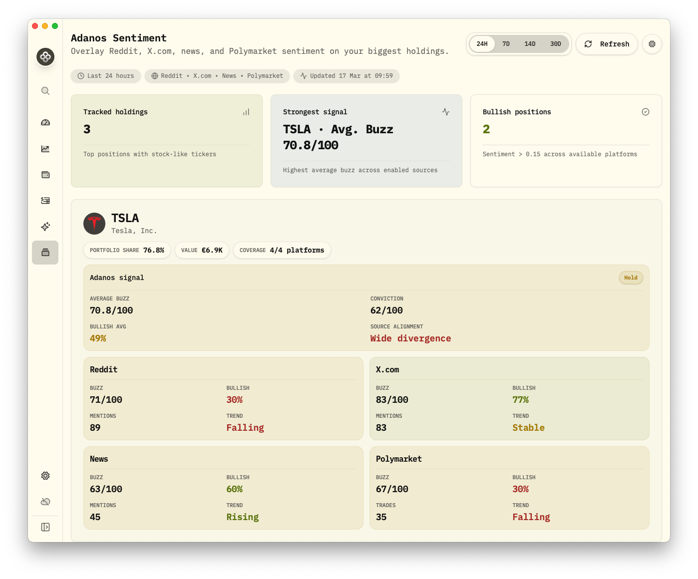

# Adanos Market Sentiment Addon for Wealthfolio



`adanos-sentiment` is a Wealthfolio add-on that overlays Adanos market
sentiment directly on top of portfolio holdings.

It combines finance sentiment from:

- Reddit
- X.com
- News
- Polymarket

The add-on is built for traders and active investors who want faster context on:

- where attention is building
- whether bullish conviction is broad or isolated
- whether momentum is rising, stable, or fading across sources
- which portfolio names are attracting the strongest composite signal

## What it shows

For each tracked holding, the add-on shows:

- composite Adanos signal
- average buzz
- conviction
- bullish average
- source alignment

For each enabled source, it shows:

- buzz
- bullish %
- mentions or trades
- trend

The settings screen also shows:

- secure API key configuration
- enabled platforms
- account type
- monthly quota status
- remaining free requests
- upgrade CTA when the monthly free limit is exhausted

## API

- Docs: <https://api.adanos.org/docs>
- Pricing: <https://adanos.org/pricing>
- Get API key: <https://adanos.org/reddit-stock-sentiment#api>

## Install in Wealthfolio

The add-on requires Wealthfolio 3.7.0 or newer.

1. Download `adanos-sentiment-1.1.0.zip` from the latest GitHub release.
2. Open Wealthfolio's add-on settings.
3. Install the downloaded add-on file.

After installation, open **Adanos Sentiment**, add an Adanos API key in the
settings page, and choose the sources to query.

## Development

The source builds independently with the public Wealthfolio 3.7 packages:

```bash
pnpm install
pnpm test
pnpm type-check
pnpm bundle
```

The generated ZIP in `dist/` contains the manifest and production bundle.

## Data and permissions

- The API key is encrypted in Wealthfolio's add-on-scoped secrets storage.
- Preferences and cached quota metadata use Wealthfolio's durable add-on storage.
- Portfolio ticker symbols are sent only to `https://api.adanos.org`, through
  Wealthfolio's network broker. The allowed host is declared in `manifest.json`.
- The add-on reads holdings but does not place trades or modify portfolio data.

## Request usage

- Account status checks use 1 API request.
- The dashboard currently uses the existing Adanos stock detail endpoints to
  surface source-level `bullish_pct` and `trend`.
- Requests use explicit inclusive UTC `from` and `to` dates.
- A full dashboard refresh can therefore use multiple requests on free plans, up
  to `10 holdings x 4 platforms` in the current UI.
- If a free account reaches the monthly cap, the add-on links to the pricing
  page. The API key remains valid after upgrading.

## License

MIT
